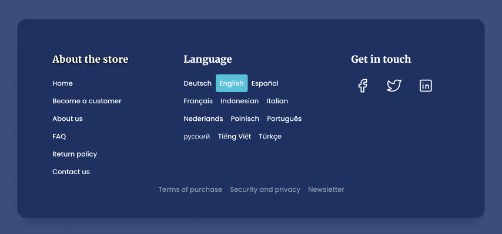

# Rodapé de uma página da Web

# Sobre o Projeto

O projeto foi criado como parte de exercício avaliativo da UC de Usabilidade, Desenvolvimento Web, Mobile e Jogos.
O Objetivo do exercício é implementar em HTML e CSS o [protótipo](https://uidesigndaily.com/posts/figma-footer-dark-mode-day-1521) de tela em alta fidelidade disponibilizado pelo professor.
